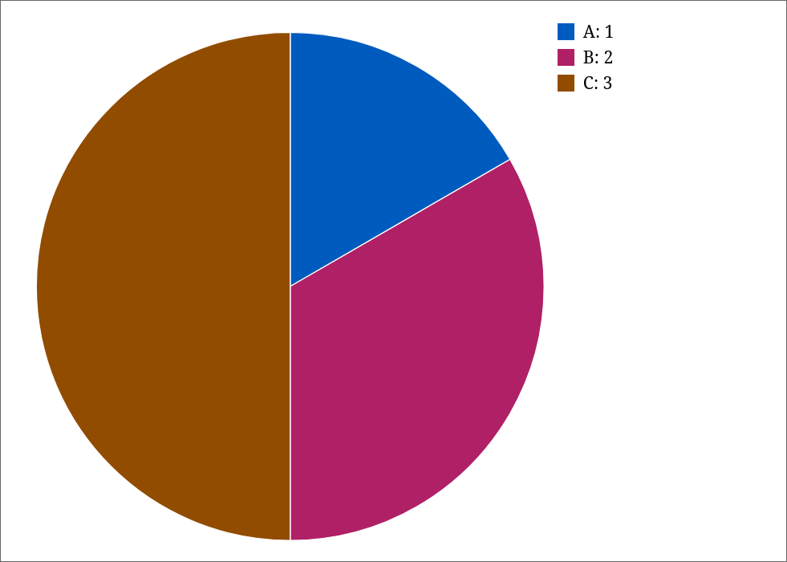
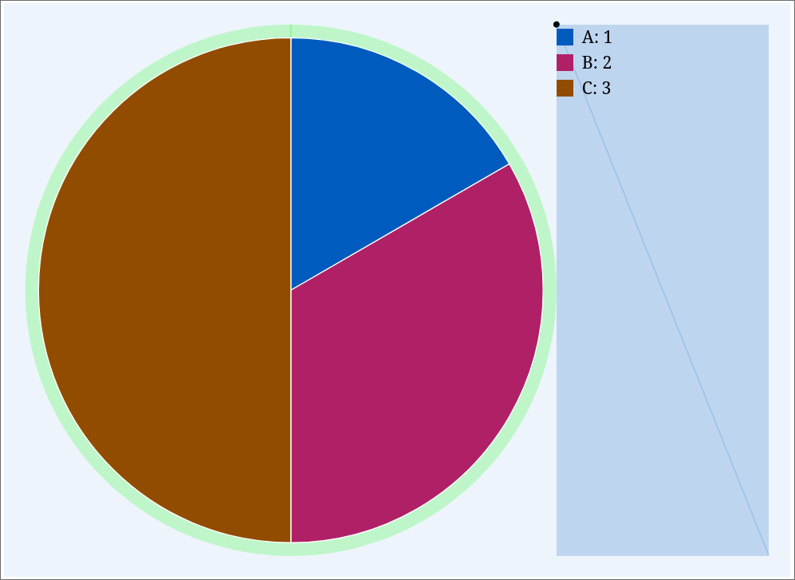
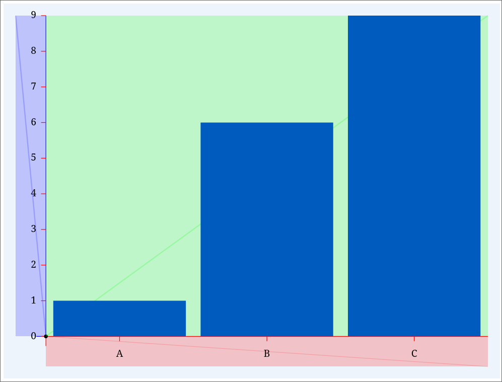
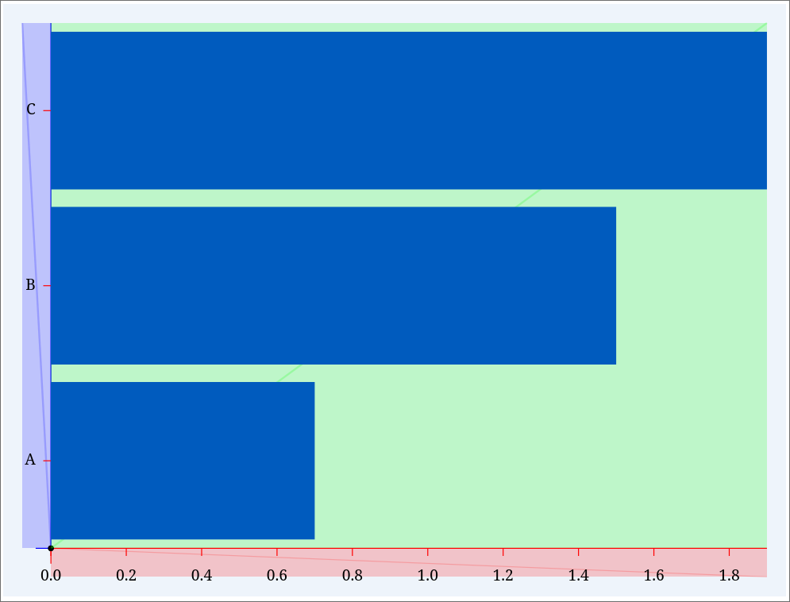
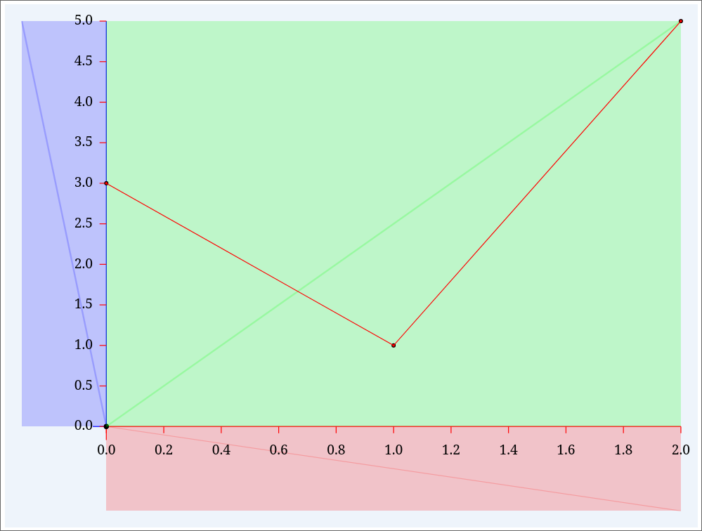
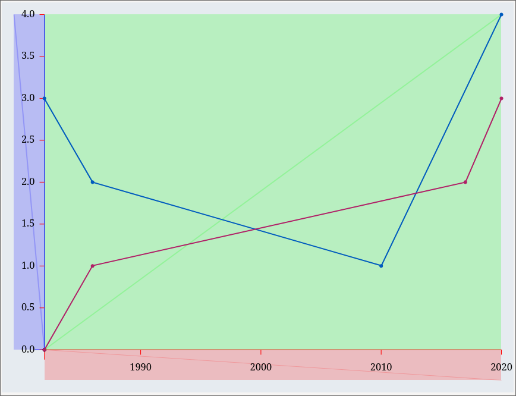
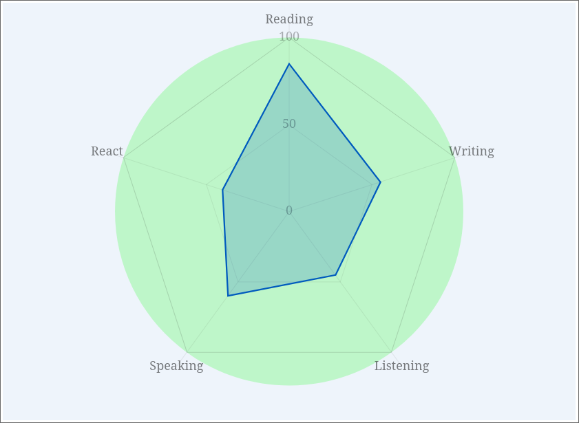
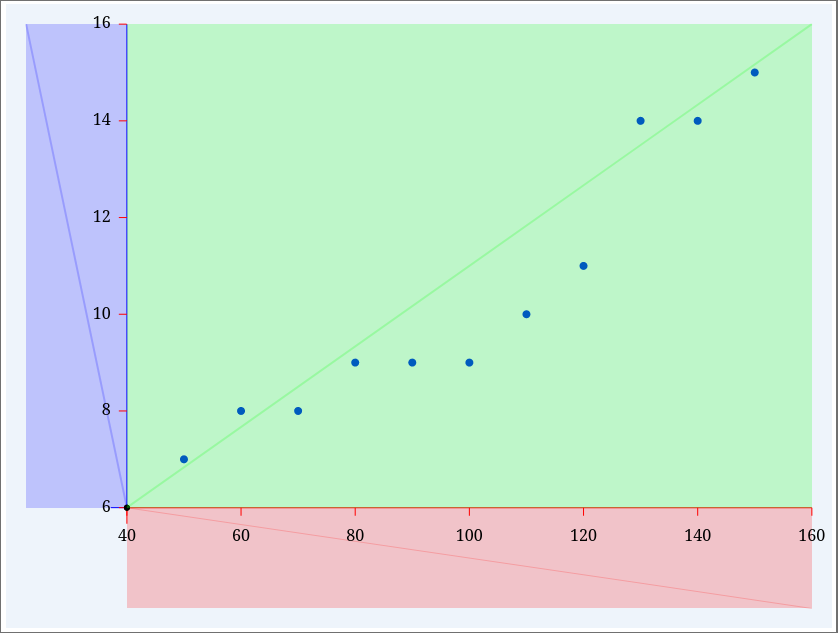

# A visualization library for leptos.

The project provides chart types to draw for leptos.


- [x] PieChart
- [x] BarChart
- [x] LineChart
- [x] RadarChart
- [x] ScatterChart
- [x] LineChartGroup
- [x] BarChartGroup


# Examples and Usage

## PieChart

### `Cargo.toml`

```toml
leptos = {version = "0.4.1"}
leptos_chart = {version = "0.1.0", features = ["PieChart"]}
```

### `main.rs`

```rust
use leptos::*;
use leptos_chart::*;

fn main() {
    wasm_logger::init(wasm_logger::Config::default());
    leptos::mount_to_body(|cx| leptos::view! { cx,  <App/> })
}

#[component]
pub fn App(cx: Scope) -> impl IntoView {
    let chart = Polar::new(
        Series::from(vec![1.0, 2.0, 3.]),
        Series::from(vec!["A", "B", "C"]),
    )
    .set_view(740, 540, 1, 200, 20);

    view! {cx,
        <div class="mx-auto p-8" style="background:#00000077">
            <h1>"Pie chart example with right label"</h1>
            <PieChart chart=chart />
        </div>
    }
}
```

### Result



### With feature debug




## BarChart

### `Cargo.toml`

```toml
leptos = {version = "0.4.1"}
leptos_chart = {version = "0.1.0", features = ["BarChart"]}
```

### `main.rs`

```rust
use leptos::*;
use leptos_chart::*;

fn main() {
    wasm_logger::init(wasm_logger::Config::default());
    leptos::mount_to_body(|cx| leptos::view! { cx,  <App/> })
}

#[component]
pub fn App(cx: Scope) -> impl IntoView {
    let chart_v = Cartesian::new(
        Series::from(vec!["A", "B", "C"]),
        Series::from(vec![1.0, 6.0, 9.]),
    )
    .set_view(820, 620, 3, 50, 50, 20);

    let chart_h = Cartesian::new(
        Series::from(vec![0.7, 1.5, 1.9]),
        Series::from(vec!["A", "B", "C"]),
    )
    .set_view(820, 620, 3, 30, 30, 20);

    view! {cx,
        <div class="mx-auto p-8" style="background:#00000077">

            <h1>"Bar chart example"</h1>
            <BarChart chart=chart_v />

            <h1>"Bar chart example"</h1>
            <BarChart chart=chart_h />
        </div>
    }
}

```
### Result (debug)






## BarChartGroup

### `Cargo.toml`

```toml
leptos = {version = "0.4.1"}
leptos_chart = {version = "0.1.0", features = ["BarChart"]}
```

### `main.rs`

```rust
use leptos::*;
use leptos_chart::*;

fn main() {
    wasm_logger::init(wasm_logger::Config::default());
    leptos::mount_to_body(|cx| leptos::view! { cx,  <App/> })
}

#[component]
pub fn App(cx: Scope) -> impl IntoView {
    let chart = CartesianGroup::new()
        .set_view(840, 640, 3, 50, 50, 20)
        .add_data(
            Series::from(vec!["A", "B", "C"]),
            Series::from(vec![0.7, 1.5, 1.9]),
        )
        .add_data(
            Series::from(vec!["A", "B", "C"]),
            Series::from(vec![0.3, 0.5, 0.9]),
        );

    view! {cx,
        <div class="mx-auto p-8">
            <h1>"Bar chart stack example"</h1>
            <BarChartGroup chart=chart />
        </div>
    }
}

```
### Result (debug)


## LineChart

### `Cargo.toml`

```toml
leptos = {version = "0.4.1"}
leptos_chart = {version = "0.1.0", features = ["LineChart"]}
```

### `main.rs`

```rust
use leptos::*;
use leptos_chart::*;

fn main() {
    wasm_logger::init(wasm_logger::Config::default());
    leptos::mount_to_body(|cx| leptos::view! { cx,  <App/> })
}

#[component]
pub fn App(cx: Scope) -> impl IntoView {
    let chart = Cartesian::new(
        Series::from(vec![0., 1.0, 2.]),
        Series::from(vec![3.0, 1.0, 5.]),
    )
    .set_view(820, 620, 3, 100, 100, 20);

    view! {cx,
        <div class="mx-auto p-8" style="background:#00000077">
            <h1>"Line chart example"</h1>
            <LineChart chart=chart />
        </div>
    }
}
```
### Result (debug)


## LineChartGroup

### `Cargo.toml`

```toml
leptos = {version = "0.4.1"}
leptos_chart = {version = "0.1.0", features = ["LineChartGroup"]}
```

### `main.rs`

```rust
use leptos::*;
use leptos_chart::*;

fn main() {
    wasm_logger::init(wasm_logger::Config::default());
    leptos::mount_to_body(|cx| leptos::view! { cx,  <App/> })
}

#[component]
pub fn App(cx: Scope) -> impl IntoView {
    
    let chart = CartesianGroup::new()    
    .set_view(840, 640, 3, 50, 50, 20)   
    .add_data(
        Series::from((vec!["1982", "1986", "2010", "2020", ], "%Y", "year")),
        Series::from(vec![3., 2.0, 1., 4.]),        
    )
    .add_data(
        Series::from((vec!["1982", "1986", "2017", "2020"], "%Y", "year")),
        Series::from(vec![0., 1.0, 2., 3.]),        
    );

    view! {cx,
        <div class="mx-auto p-8">
            <h1>"Line chart group example"</h1>
            <LineChartGroup chart=chart />
        </div>
    }
}
```
### Result (debug)


## RadarChart

### `Cargo.toml`

```toml
leptos = {version = "0.4.1"}
leptos_chart = {version = "0.1.0", features = ["RadarChart"]}
```

### `main.rs`

```rust
use leptos::*;
use leptos_chart::*;

fn main() {
    wasm_logger::init(wasm_logger::Config::default());
    leptos::mount_to_body(|cx| leptos::view! { cx,  <App/> })
}

#[component]
pub fn App(cx: Scope) -> impl IntoView {
    let chart = Polar::new(
        Series::from(vec![85.0, 55.0, 45., 60., 40.]),
        Series::from(vec!["Reading", "Writing", "Listening", "Speaking", "React"]),
    )
    .set_view(740, 540, 1, 0, 20);

    view! {cx,
        <div class="mx-auto p-8">
            <h1>"Radar chart example"</h1>
            <RadarChart chart=chart />
        </div>
    }
}
```

### Result (debug)



## ScatterChart

### `Cargo.toml`

```toml
leptos = {version = "0.4.1"}
leptos_chart = {version = "0.1.0", features = ["ScatterChart"]}
```

### `main.rs`

```rust
use leptos::*;
use leptos_chart::*;

fn main() {
    wasm_logger::init(wasm_logger::Config::default());
    leptos::mount_to_body(|cx| leptos::view! { cx,  <App/> })
}

#[component]
pub fn App(cx: Scope) -> impl IntoView {
    let chart = Cartesian::new(
        Series::from(vec![50,60,70,80,90,100,110,120,130,140,150])
            .set_range(40., 160.),
        Series::from(vec![7,8,8,9,9,9,10,11,14,14,15])
            .set_range(6., 16.),
    )
    .set_view(820, 620, 3, 100, 100, 20);

    view! {cx,
        <div class="mx-auto p-8">
            <h1>"Scatter chart example"</h1>
            <ScatterChart chart=chart />
        </div>
    }
}
```

### Result (debug)


