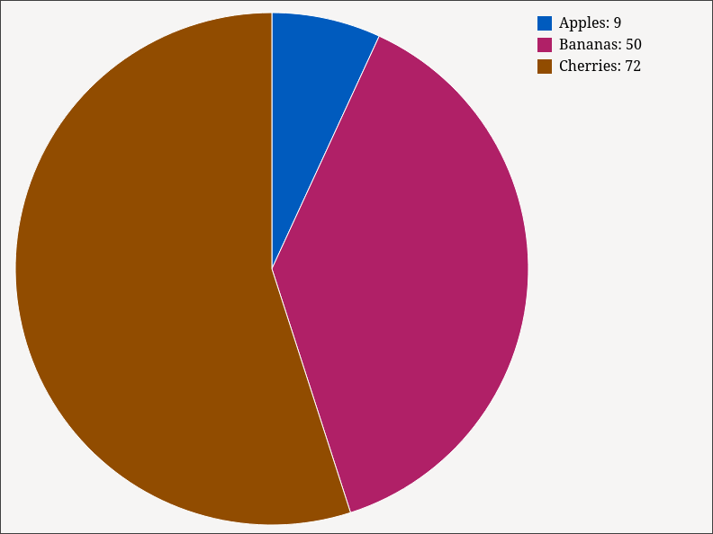

# A visualization library for leptos.

The project provides chart types to draw for leptos.


- [x] PieChart
- [x] BarChart
- [ ] LineChart
- [ ] AreaChart
- [ ] Scatter Chart

# Examples and Usage

## PieChart

`Cargo.toml`
```toml
leptos = {version = "0.3.0"}
leptos_chart = {version = "0.0.2", features = ["PieChart"]}
```

`main.rs`
```rust
use leptos::*;
use leptos_chart::*;

fn main() {     
    leptos::mount_to_body(|cx| leptos::view! { cx,  <App/> })
}

#[component]
pub fn App(cx: Scope) -> impl IntoView { 

    let data = DataPie::default()        
            .set_view(800, 600, 0b0010, 200, 10)
            .set_data(vec![9.0, 50.0, 72.0])
            .set_label(vec!["Apples", "Bananas", "Cherries"]);

    view! {cx,
        <div class="mx-auto p-8">
            <h1>"Pie chart example with right label"</h1>
            <PieChart data=data_r />
        </div>
    } 
}   
```

## BarChart

`Cargo.toml`
```toml
leptos = {version = "0.3.0"}
leptos_chart = {version = "0.0.2", features = ["PieChart"]}
```

`main.rs`
```rust
use leptos::*;
use leptos_chart::*;

fn main() {        
    leptos::mount_to_body(|cx| leptos::view! { cx,  <App/> })
}

#[component]
pub fn App(cx: Scope) -> impl IntoView {    

    let data_h = DataBar::default()        
        .set_view(800, 600, false, 50, 15)
        .set_data(vec![370.0, 200.0, 175.0, 82., 54.])
        .set_label(vec!["A", "B", "C", "D", "E"]);
    
    let data_v = DataBar::default()        
        .set_view(800, 600, true, 50, 10)
        .set_data(vec![2.0, 5., 7.])
        .set_label(vec!["Apples", "Bananas", "Cherries"]);

    view! {cx,
        <div class="mx-auto p-8">            

            <h1>"Bar chart horizontal"</h1>
            <BarChart data=data_h />


            <h1>"Bar chart vertical"</h1>
            <BarChart data=data_v />
        </div>
    }
}

```



Check out the examples folder for helpful snippets of code, as well as minimal configurations that fit some of the most popular chart types. For more explanation, see the crate documentation.


// TODO: add title for x-axis and y-axis